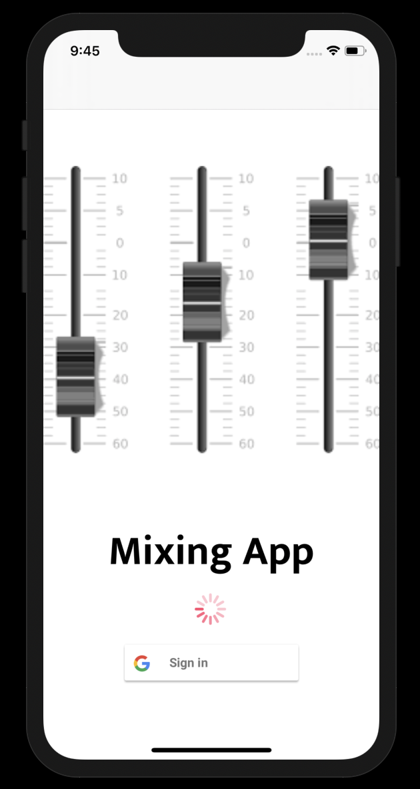

# MixingApp-Final-Udacity-Project

## Description

This app is intended to mix audio tracks by panning, changing their volume, and equalizing them. The user can import their own audio files (mp3 only) with a max of 6 currently so they can blend tracks and create their own mix with their recorded raw multitracks.

The app starts off with the login screen where you can sign into the app using google sign-in.

Then when authenticated it will bring you to a new window where you can select your projects or create a new one.

If not created just click the plus button and it will prompt you with an alert view to name your project.

Select your project. Now it should be loading but you will be able to see the general interface.

Once the project is finished loading...
Now we are inside the project where you can see 6 tracks in a collection with a pan knob, volume slider, mute and solo button, and a label telling you which track it is as well as a light in the top right corner of the cell telling you if there is track imported into that cell or not, initially gray when launched when theres no track, blue when theres a track imported into that cell, and black when the track has been removed.
As well as an eq window with 8 knobs that modify the whole frequency spectrum. (20hz-20khz)
A play button and a go back button that restarts the songs.
Lastly, a label to track the upload progress when you import tracks because it uploads to the Firebase Storage!

Now you can mess around with each cell's pan knob and that will alter the audios position between Left and Right. If you put the pan knob position all the way to the right, the sound will only come out of the right speaker and all the way to left it will come out of the left speaker.

You can also modify the tracks volume with the volume slider so you can blend tracks together or match the audio level.

Mute: You are also able to mute a track which will make the track not generate any sound until you want to unmute it, this is useful when you want to cut out certain tracks to hear how other tracks sound with another. It will light up a certain blue when selected.

Solo: You can solo a track which will cut out all the audio on every other track but the one you selected. This is useful when you want to hear specific tracks by themselves, you can solo multiple tracks. It will light up a certain yellow when selected.

Double tap on the track name label (where it says 'track #' on a cell) and the cell will flip around showing buttons Import Track, Remove Track, or Go back.

Tapping Import Track: This will open up a files controller that will show the audio files in your phone, select one and confirm it and then that the audio file is imported into that track! and that blue light will be on for that cell.

Tapping Remove Track: This will remove the audio file from the track and the database.

Tapping Go Back: This will flip the cell back around so you can access the tracks properties (pan, volume, mute solo).

If a track is already imported the Import Track button will be faded out but if there is no track imported the Remove Track button will be faded out.

When you import a track it will display at the bottom in a label your uploading progress, as it uploads your track to the database so if you reload the app it will load the same track back into your project.

When the audio file has successfully uploaded to the database, the label will say Upload Complete!

Play: If you press the play button it will play all your tracks (if imported) at the same time and the play button will turn into a stop button, when you click the stop button it will pause the tracks and it will turn back into a play button.

Rewind: If you press the rewind button it will restart all your tracks to the beginning then you just have to press play and it will play them.

EQ: Also to mention one more thing, to activate the EQ for a track you just need to tap on a track and it will initiate. Then you can use the 8 knobs to modify that tracks frequencies. The Gain knobs add volume to the corresponding frequency that is set in the Freq knobs. Have fun with it!
